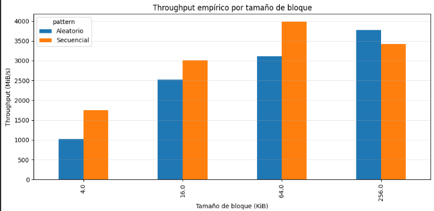
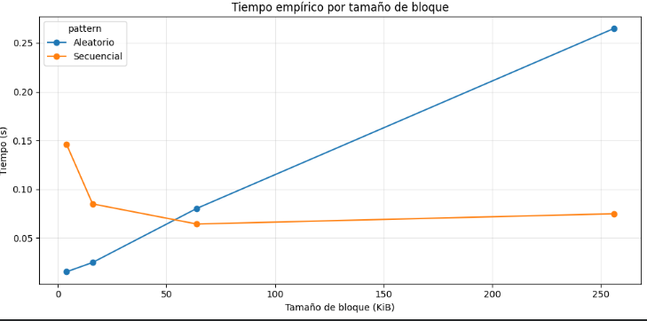

# Laboratorio 3

Para resolver este laboratorio usaré un computador con las siguientes caracteristicas:
OS : Archlinux
CPU : Intel core 5
Ram : 15.25GB
Disk : 280GB (libre)

## Conceptos

Latencia : es el tiempo que tarda acceder a al inicio de un bloque de datos.
throughput : es lo que tarda en leer un bloque de datos.
m ≈ 1 porqe se necesito como mínimo un bloque o más de datos para leer.
m tiende a ser mayor debido a la fragmentación de los archivos, es decir, que un archivo puede estar dividido en varios bloques de datos.

## Configuración

1. El tamaño del archivo que se usará (256MB) es completamente posible de guardarlo en la memoria ram.

2. El bloque que esperaría que tuviera mejor rendimiento es el de 4KB, porque al ser menor cantidad de bytes se leería y escribiría más rapidamente.

3. Este experimento se está ejecutando en google colab.

## Archivo de prueba

1. Este archivo cumple con el objetivo de analizar los tiempos I/O (entrada y salida)

2. Trabajar con archivo grande puede ser util para analizar mejor el tiempo de creación.

3. Si el archivo es demasiado pequeño, se puede cargar en la ram por lo que no se estaría estudiando el I/O del disco sino de la ram.

## Análisis de resultados empírcos

1. En casi todos los casos evaluados (4 KB, 16 KB y 64 KB), el acceso secuencial obtuvo un mejor rendimiento en términos de throughput (MiB/s). excepto el de 256KB, esto pudo haber sido causado por el cache del sistema.

2. Sí, el throughput aumentó significativamente conforme creció el tamaño de bloque, esto sucede porque al usar bloques más grandes, el sistema realiza menos "viajes" (operaciones de I/O) para mover la misma cantidad de datos.

3. La mayor diferencia absoluta de rendimiento se observó en el tamaño de bloque de 64 KB.

## Modelo teórico elegido
Dispositivo modelado: SSD NVMe (aproximado).
Latencia asumida: $10$ µs ($1 \times 10^{-5}$ segundos).
Throughput asumido: $5$ GB/s ($5368709120$ bytes/s).

## teoría vs práctica
1. En general, los tiempos empíricos son ligeramente mayores que los teóricos, lo que resulta en un throughput real menor al ideal

2. La teoría se aproxima mejor en el patrón de acceso aleatorio con bloques grandes (256 KB).

3. pueden haber varios factores: Caché del Sistema Operativo (Page Cache), Overhead del Sistema de Archivos, Carga del sistema y Estrangulamiento Térmico (Thermal Throttling).

## Gráfica throughput

1. El acceso secuencial tiene mejor rendimiento (son mayores) excepto en el bloque de 256KB.

2. Entre mayor sea la barra, mayor es el rendimiento.

3. El mejor patrón es el secuencial.

## Tiempo empírico

Se apresia que a menor tamaño del bloque el patrón aleatorio es mucho mejor pero a medida que el bloque crece se invierte y el patrón secuencial toma mucho menos tiempo que el aleatorio.

## Preguntas de cierre

1. Comparación de patrones:En el bloque estándar de 4 KB, el acceso secuencial
fue aproximadamente 1.7 veces más rápido ($1754$ vs $1025$ MiB/s). El resultado
era el esperado, ya que la teoría predice que el patrón secuencial siempre
supera al aleatorio debido a la pre-lectura (read-ahead) del hardware, aunque en
un SSD la brecha es mucho menor que en un HDD.
2. Efecto del tamaño de bloque:El throughput del acceso aleatorio aumentó
drásticamente (de $1025$ MiB/s a $3776$ MiB/s) al subir de 4 KB a 256 KB. Esto
sucede porque, con bloques más grandes, cada operación de I/O transfiere más
datos útiles, lo que reduce el impacto de la latencia de acceso inicial y
aprovecha mejor el ancho de banda del bus PCIe.
3. Teoría vs práctica:En el acceso aleatorio de 4 KB, la medición empírica
($0.015$ s) fue notablemente más rápida que la teórica ($0.043$ s). Atribuyo
esta diferencia a la Page Cache del kernel de Linux, que probablemente mantuvo
parte de los datos en RAM, entregándolos con una latencia de nanosegundos en
lugar de los microsegundos del SSD.
4. Tipo de disco:Mi equipo se comportó claramente como un SSD NVMe. Los valores
obtenidos (superiores a los $3000$ MiB/s) exceden por mucho el límite teórico de
un SSD SATA ($500$ MB/s) y están órdenes de magnitud por encima de un HDD ($100$
MB/s). 
5. Aplicación práctica:Preferiría leerla de forma secuencial. Dado que el
throughput secuencial en mi equipo es consistentemente alto (alcanzando casi $4$
GB/s), el sistema terminaría de leer el millón de registros en una fracción de
segundo, evitando las penalizaciones de latencia acumuladas que generarían un
millón de búsquedas aleatorias individuales.